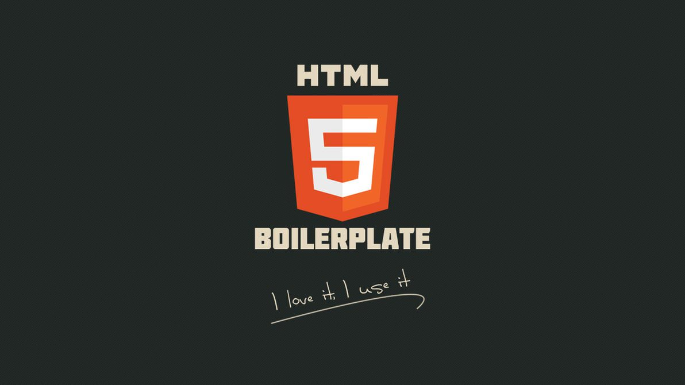

# Boilerplate

When starting a new web project, setting up a solid foundation is crucial. An **HTML** boilerplate serves as this foundation, providing a standard starting point that ensures best practices and compatibility across different browsers.

## What is an HTML Boilerplate?

An HTML boilerplate is a set of pre-written **HTML, CSS, and JavaScript** files that form the starting point for your web project. It includes essential elements like the doctype declaration, meta tags, link to **CSS** files, and script tags for **JavaScript**. The primary goal is to save time and ensure consistency by providing a robust template that follows industry standards.

### Why Use an HTML Boilerplate?
Using an HTML boilerplate has several benefits:

___Efficiency:___ Quickly set up new projects without rewriting the same basic structure each time.
Consistency: Maintain a consistent structure and style across multiple projects.
___Best Practices:___ Follow industry standards and best practices out of the box.
___Cross-browser Compatibility:___ Ensure your site works well across different browsers and devices.
___Components of HTML Boilerplate___
An HTML Boilerplate typically includes the following components:

#### HTML: The Language
 The fundamental markup language used to structure the content of a website.
___CSS:___ The language used for styling and layout of a website, enhancing the visual presentation. This is optional but commonly included.
___JavaScript:___ A programming language for adding interactivity and dynamic functionality to a website. This is also optional but widely used.
Essential Elements of an HTML Boilerplate
Table of Content

##### Doctype Declaration
*HTML Tag and Language Attribute
*Head Section
*Body Section
*Doctype Declaration
The doctype declaration is crucial as it tells the browser which version of HTML you are using. The most common doctype for modern web development is HTML5:

___HTML Tag and Language Attribute___
The <html> tag is the root element of an HTML document. Including the lang attribute specifies the language of the content, which is important for accessibility and SEO:

___Head Section___
The <head> section contains meta-information about the document, such as the character set, viewport settings, and links to CSS files:


___Body Section___
The <body> section contains the content of your website. This is where you’ll place your HTML elements that will be visible to users:

```<!DOCTYPE html>
<html lang="en">

<head>
    <meta charset="UTF-8">
    <meta name="viewport" content="width=device-width,
                                   initial-scale=1.0">
    <title>My Project</title>

    <!-- To link external styling file -->
    <link rel="stylesheet" href="styles.css">
</head>

<body>
    <header>
        <h1>
            Welcome to My GeeksforGeeks
        </h1>
    </header>
    <main>
        <p>
            This is where your content goes.
        </p>
    </main>
    <footer>
        <p>&copy; 2024 My Project</p>
    </footer>
    <!-- To link external javascript file -->
    <script src="scripts.js"></script>
</body>

</html>```

This is [a reference].
(https://www.geeksforgeeks.org/html-boilerplate)